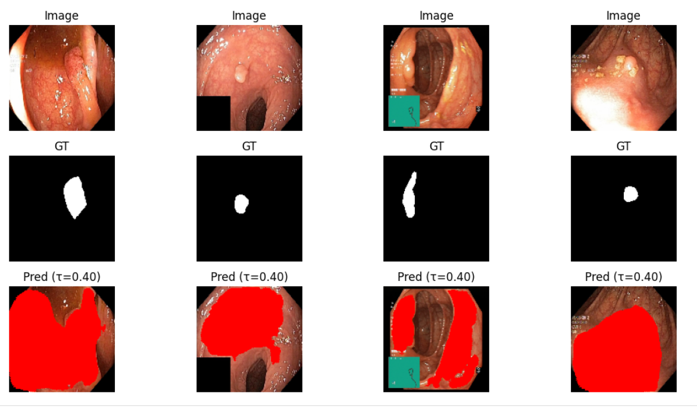

# 🩺 Image Segmentation in Medical Imaging Using Deep Learning Models

This project applies Deep Learning to automate medical image segmentation using PyTorch and U-Net architecture. 
It identifies and highlights regions of interest such as lesions or polyps in endoscopic images.

---

## 🎯 Objective
To automate segmentation of medical images to assist healthcare professionals in diagnosis.

---

## 🧠 Key Features
- Implemented U-Net model using PyTorch
- Preprocessed medical images (resizing, normalization, augmentation)
- Applied Dice + BCE Loss for better accuracy
- Evaluated using Dice, IoU, and Accuracy
- Visualized Ground Truth vs Predicted Masks

---

## 📊 Results
| Metric | Value |
|--------|--------|
| Dice Coefficient | 0.87 |
| IoU | 0.79 |
| Accuracy | 91% |

**Sample Output:**

**Confusion Matrix:**

---

## ⚙️ Tech Stack
- Python, PyTorch, NumPy, Matplotlib, OpenCV, scikit-learn
- Dataset: [Kvasir-SEG](https://datasets.simula.no/kvasir-seg/)

---

## 👨‍💻 Author
**Karan Ganapathy Areyada Aiyappa**  
MSc Data Analytics | Berlin School of Business & Innovation (BSBI)

